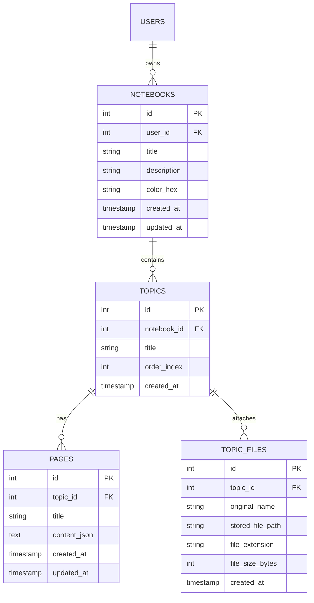
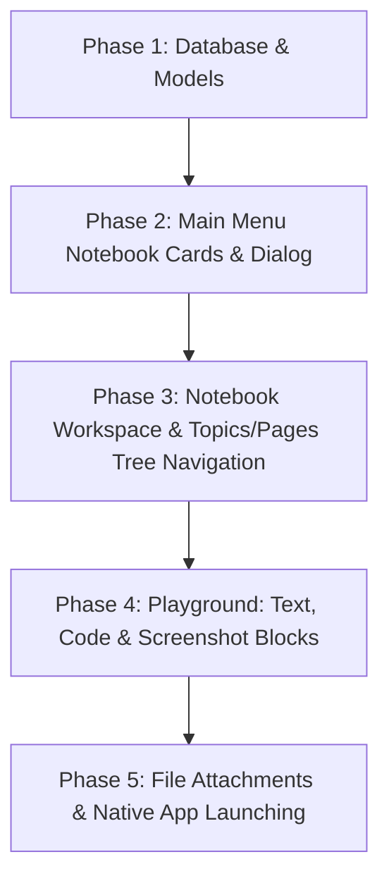

# Full Implementation Plan: Study Buddy Notebook System

## 1. Overview & Vision
The **Notebook System** is Study Buddy's central learning and note-taking playground.
It follows a clean, intuitive hierarchical organization:

$$\text{User} \longrightarrow \text{Notebooks} \longrightarrow \text{Topics} \longrightarrow \begin{cases} \text{Pages} & (\text{Text, Code blocks, Screenshots}) \\ \text{Attachments} & (\text{PDF, PPTX, DOCX with native app opening}) \end{cases}$$

Every page acts as a rich canvas for notes, copyable code snippets, and clipboard-pasted screenshots. Every topic can also house lecture slides, PDFs, and assignments that launch instantly in the student's default native apps (e.g. WPS Office, Acrobat, MS Word).

---

## 2. Database Schema & Data Models

We will extend [DatabaseHelper.java](file:///c:/Users/User/IdeaProjects/Study_Buddy/src/main/java/com/example/study_buddy/DatabaseHelper.java) with four normalized SQLite tables:



### Corresponding Java Models
1. **`Notebook.java`**: `id`, `userId`, `title`, `description`, `colorHex`, `topicCount`, `updatedAt`
2. **`Topic.java`**: `id`, `notebookId`, `title`, `orderIndex`, `pagesList`, `filesList`
3. **`Page.java`**: `id`, `topicId`, `title`, `contentJson`, `updatedAt`
4. **`TopicFile.java`**: `id`, `topicId`, `originalName`, `storedFilePath`, `fileExtension`, `fileSizeBytes`

---

## 3. UI/UX Architecture & Layouts

### View A: Main Menu (Recent Notebooks Dashboard)
Where `mainMenuView` currently displays the header and buttons:
- **Notebook Cards Grid**: Modern cards showing:
  - Color badge / accent stripe
  - Title and description
  - Number of topics & pages
  - Last edited timestamp
  - "Open Notebook" click target + ⚙ context menu (Rename, Change Color, Delete)
- **"+ New Notebook" Modal Dialog**:
  - Input field for notebook title
  - Optional short description
  - Color picker / curated palette buttons (Indigo, Emerald, Violet, Amber, Rose, Cyan)
- **Empty State**: Friendly illustration and prompt when the user hasn't created a notebook yet.

```
+-----------------------------------------------------------------------------------------+
| [Study Buddy 🎓]                                                          [Sidebar ▤] [Log Out] |
+-----------------------------------------------------------------------------------------+
| [Sidebar] | Recent notebooks       [ 📚 My Notebooks ]   [ + New Notebook ]             |
|           | ─────────────────────────────────────────────────────────────────────────── |
|           |  +---------------------+  +---------------------+  +---------------------+  |
|           |  | 📘 Data Structures  |  | 📗 Operating Systems|  | 📙 Database Mgmt    |  |
|           |  | 6 Topics · 18 Pages |  | 4 Topics · 12 Pages |  | 8 Topics · 22 Pages |  |
|           |  | Last edited 2h ago  |  | Last edited 1d ago  |  | Last edited 3d ago  |  |
|           |  +---------------------+  +---------------------+  +---------------------+  |
+-----------------------------------------------------------------------------------------+
```

---

### View B: Notebook Workspace View (`notebookWorkspaceView`)
When a user clicks any notebook card, the center workspace smoothly opens the Notebook Editor:

```
+-----------------------------------------------------------------------------------------+
| [◀ Back to Notebooks]   📘 Data Structures > Trees > AVL Rotations        [ Auto-saved ✓ ]|
+----------------------+------------------------------------------------------------------+
| TOPIC EXPLORER       | PAGE PLAYGROUND                                                  |
|                      |                                                                  |
| 📁 Topics  [+ Topic] | [ Title: AVL Tree Balancing ]                                    |
|   ├─ 📂 Stacks       | ───────────────────────────────────────────────────────────────  |
|   ├─ 📂 Queues       | 📝 [Rich Note Block]                                             |
|   └─ 📂 Trees        | An AVL tree is a self-balancing binary search tree where the    |
|       ├─ 📄 Binary   | height difference between left and right subtrees is at most 1.  |
|       └─ 📄 AVL Tree |                                                                  |
|                      | 💻 [Code Block] (Java)                             [📋 Copy]     |
| 📎 Files   [+ File]  | ```java                                                          |
|   ├─ 📕 lecture.pdf  | Node rotateRight(Node y) {                                       |
|   └─ 📊 slides.pptx  |     Node x = y.left; ...                                         |
|                      | }                                                                |
|                      | ```                                                              |
|                      |                                                                  |
|                      | 🖼 [Screenshot / Image Block] (Ctrl+V pasted)     [🔍 Zoom] [🗑] |
|                      | +--------------------------------------------------------------+ |
|                      | | [ Image preview: AVL rotation diagram ]                      | |
|                      | +--------------------------------------------------------------+ |
|                      |                                                                  |
|                      | [+ Add Note]   [+ Add Code Snippet]   [📷 Paste Screenshot]      |
+----------------------+------------------------------------------------------------------+
```

---

## 4. Technical Feasibility & Implementation Mechanics

### 1. Opening Files in Native Machine Apps
- **Default Application**:
  ```java
  File file = new File(topicFile.getStoredFilePath());
  if (Desktop.isDesktopSupported() && Desktop.getDesktop().isSupported(Desktop.Action.OPEN)) {
      Desktop.getDesktop().open(file);
  }
  ```
- **"Open With..." Fallback / Secondary Action**:
  On Windows, we can trigger the native Windows app selection dialog if requested:
  ```java
  new ProcessBuilder("rundll32.exe", "shell32.dll,OpenAs_RunDLL", file.getAbsolutePath()).start();
  ```
- **Storage Location**:
  Attachments are copied to a dedicated directory in the user's workspace: `study_buddy_data/attachments/<notebook_id>/`.

### 2. The Page Playground Blocks
Instead of a rigid single text field, a Page is composed of flexible, modern **Blocks**:
1. **Text / Note Block**:
   - Resizable styled text area with auto-growing height, markdown/formatted text support.
2. **Code Snippet Block**:
   - Monospace font (`Consolas`, `JetBrains Mono`, `Courier New`).
   - Dark or subtle slate container (`#1e293b`).
   - Header with language tag and a one-click **"📋 Copy Code"** button with feedback indicator.
3. **Screenshot / Image Block**:
   - **Keyboard listener**: Pressing `Ctrl + V` anywhere in the playground detects image data on the system clipboard (`Clipboard.getSystemClipboard().hasImage()`).
   - The image is saved locally to `study_buddy_data/images/` and an `ImageView` block is instantly added to the page.
   - Also supports file picker / drag & drop.

---

## 5. Phased Implementation Roadmap

To maintain clean code and verify correctness at every milestone, we propose executing in the following phases:



### Phase 1: Database & Data Models `[COMPLETED ✓]`
- Updated [DatabaseHelper.java](file:///c:/Users/User/IdeaProjects/Study_Buddy/src/main/java/com/example/study_buddy/DatabaseHelper.java) with `notebooks`, `topics`, `pages`, and `topic_files` tables.
- Created [Notebook.java](file:///c:/Users/User/IdeaProjects/Study_Buddy/src/main/java/com/example/study_buddy/Notebook.java), [Topic.java](file:///c:/Users/User/IdeaProjects/Study_Buddy/src/main/java/com/example/study_buddy/Topic.java), [Page.java](file:///c:/Users/User/IdeaProjects/Study_Buddy/src/main/java/com/example/study_buddy/Page.java), and [TopicFile.java](file:///c:/Users/User/IdeaProjects/Study_Buddy/src/main/java/com/example/study_buddy/TopicFile.java).
- Implemented full CRUD database methods (create, read by user, update, delete).

### Phase 2: Notebooks Dashboard (Cards & Creation) `[COMPLETED ✓]`
- Created the **"+ New Notebook"** modal dialog with curated palette and validation ([NotebookDialog.java](file:///c:/Users/User/IdeaProjects/Study_Buddy/src/main/java/com/example/study_buddy/NotebookDialog.java)).
- Populated `notebooksContentArea` in `mainMenuView` with dynamic notebook cards with color accent, topic/page counts, last edited timestamps, and menu (Rename, Edit, Delete).
- Seamless empty state illustration and prompt.

### Phase 3: Workspace View (Topics & Pages Navigation) `[COMPLETED ✓]`
- Added `notebookWorkspaceView` into the center `StackPane` with breadcrumbs and "◀ Back to Notebooks" navigation.
- Implemented the Topics Explorer on the left with expandable Topics, Pages, and File lists.
- Implemented adding, renaming, and deleting topics and pages.

### Phase 4: Page Playground (Text, Code Snippets, Screenshot Pasting) `[COMPLETED ✓]`
- Implemented dynamic block builder in [PageBlock.java](file:///c:/Users/User/IdeaProjects/Study_Buddy/src/main/java/com/example/study_buddy/PageBlock.java) and [HelloController.java](file:///c:/Users/User/IdeaProjects/Study_Buddy/src/main/java/com/example/study_buddy/HelloController.java).
- Rich Note block with auto-growing textarea and focus-lost SQLite auto-saving.
- Code Snippet block with syntax selector, dark slate styling, and one-click **"📋 Copy Code"** with temporary "✓ Copied!" feedback.
- Image block with caption, zoom/open in native viewer, and file upload via `FileChooser`.
- **Keyboard listener**: `Ctrl + V` pastes clipboard screenshots (`Win + Shift + S`) straight into the active page and saves to local storage `study_buddy_data/images/`.

### Phase 5: File Attachments & Native Machine Launcher `[COMPLETED ✓]`
- Implemented "+ File" / "📎 Attach File..." action supporting `.pdf`, `.pptx`, `.docx`, `.xlsx`, `.txt`, images.
- Files cleanly stored in `study_buddy_data/attachments/<notebook_id>/`.
- Single-click or "▶ Open (Default App)" opens in student's default native app (e.g. WPS Office, Acrobat, Word).
- "⚙ Choose App (Open With...)" triggers native Windows application chooser.
- "📁 Show in Explorer" reveals file in Windows Explorer.

---

## 6. Verification & Quality Assurance Plan
1. **Compilation**: `mvn clean compile` passes after every step.
2. **Data Integrity**: Verify SQLite foreign keys cascade correctly when deleting a notebook or topic.
3. **OS File Launching**: Test opening `.pdf` (e.g. WPS Office / browser) and `.docx` (MS Word / WPS).
4. **Clipboard Testing**: Copy an image from Windows Snipping Tool (`Win + Shift + S`) and verify `Ctrl + V` pastes it into the active page.
5. **Code Snippet**: Verify copying code copies exact text and preserves indentation.
