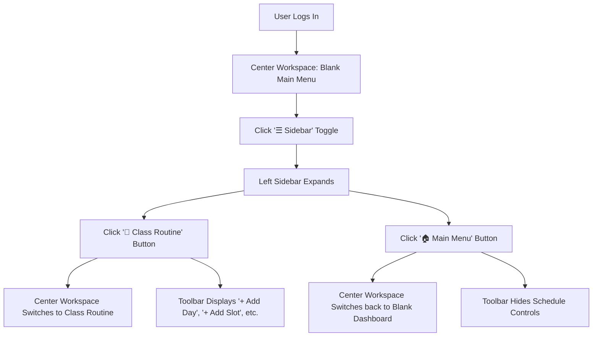

# Implementation Plan: Move Routine to Left Sidebar Navigation

## 1. Overview
The goal of this task is to decouple the **Class Routine** from the default main menu view and place its navigation into the collapsible **Left Sidebar**. When a user logs in, the main menu area where the routine was previously displayed will be kept **blank** (ready for future dashboard widgets). When the user opens the left sidebar and clicks the **Routine** button, the app displays the Routine view with all existing functionality, editing dialogs, and styling completely intact.

---

## 2. User Journey & Interaction Flow



1. **Default State**:
   - The user logs in and lands on the **Main Menu**.
   - The center content area is blank (clean, modern placeholder container).
   - Top schedule controls (`+ Add Day`, `- Remove Day`, `+ Add Slot`, `- Remove Slot`) are hidden from the top toolbar to avoid clutter.
   - Subtitle displays `"Dashboard"`.
2. **Opening Left Sidebar**:
   - The user clicks `☰ Sidebar` on the top toolbar.
   - The sidebar smoothly animates open to `230px` width.
   - The sidebar displays navigation items:
     - 🏠 **Main Menu**
     - 📅 **Class Routine**
3. **Switching to Routine**:
   - Clicking **Class Routine** sets the center view to the routine grid.
   - The top toolbar displays schedule controls (`+ Add Day`, `- Remove Day`, `+ Add Slot`, `- Remove Slot`).
   - The subtitle displays `"Class Routine"`.
   - All existing routine behaviors (saving to SQLite, cell clicks opening `RoutineDetailDialog`, right-click context menus for days & slots) remain identical.
4. **Switching Back to Main Menu**:
   - Clicking **Main Menu** in the sidebar restores the blank main workspace.
   - Schedule controls are hidden.

---

## 3. Detailed Component Architecture

### A. FXML Layout Changes (`src/main/resources/com/example/study_buddy/hello-view.fxml`)
1. **Left Sidebar Navigation Container (`#leftSidebarContent`)**:
   - Add two navigation buttons:
     - `navHomeBtn`: `<Button fx:id="navHomeBtn" text="🏠  Main Menu" onAction="#handleOpenMainMenu" styleClass="nav-item" />`
     - `navRoutineBtn`: `<Button fx:id="navRoutineBtn" text="📅  Class Routine" onAction="#handleOpenRoutine" styleClass="nav-item" />`
2. **Top Schedule Controls Toolbar**:
   - Assign `fx:id="scheduleControls"` to the `HBox` containing `+ Add Day`, `- Remove Day`, `+ Add Slot`, and `- Remove Slot`.
   - Set `visible="false"` and `managed="false"` by default so they only show when on the Routine view.
3. **Center Workspace (`StackPane fx:id="centerWorkspace"`)**:
   - Replace the standalone `ScrollPane` with a `StackPane` containing two distinct views:
     - **View 1: `mainMenuView` (`VBox fx:id="mainMenuView"`):**
       - Clean, styled blank card container (`style="-fx-background-color: #ffffff; -fx-background-radius: 10px; -fx-border-color: #e2e8f0; -fx-border-radius: 10px;"`).
       - Maintained blank for future dashboard widgets.
       - Visible & managed by default.
     - **View 2: `routineView` (`ScrollPane fx:id="routineView"`):**
       - Contains the existing `Weekly Class Routine` header label, helper text, and `GridPane fx:id="routineGrid"`.
       - Invisible & unmanaged by default until requested.

---

### B. Styling Additions (`src/main/resources/com/example/study_buddy/styles.css`)
Add styles for sidebar navigation items:
```css
/* Sidebar Navigation Buttons */
.nav-item {
    -fx-background-color: transparent;
    -fx-text-fill: #334155;
    -fx-font-size: 13px;
    -fx-font-weight: bold;
    -fx-alignment: CENTER_LEFT;
    -fx-padding: 10px 14px;
    -fx-background-radius: 8px;
    -fx-cursor: hand;
    -fx-border-color: transparent;
}

.nav-item:hover {
    -fx-background-color: #f1f5f9;
    -fx-text-fill: #1e293b;
}

.nav-item-active {
    -fx-background-color: #e0e7ff;
    -fx-text-fill: #4338ca;
    -fx-border-color: #c7d2fe;
    -fx-border-radius: 8px;
}
```

---

### C. Controller Logic (`src/main/java/com/example/study_buddy/HelloController.java`)
1. **FXML Injections**:
   ```java
   @FXML private VBox mainMenuView;
   @FXML private ScrollPane routineView;
   @FXML private HBox scheduleControls;
   @FXML private Button navHomeBtn;
   @FXML private Button navRoutineBtn;
   ```
2. **Navigation Handler Methods**:
   ```java
   @FXML
   public void handleOpenMainMenu() {
       mainMenuView.setVisible(true);
       mainMenuView.setManaged(true);
       routineView.setVisible(false);
       routineView.setManaged(false);
       if (scheduleControls != null) {
           scheduleControls.setVisible(false);
           scheduleControls.setManaged(false);
       }
       if (welcomeText != null) {
           welcomeText.setText("Dashboard");
       }
       updateNavActiveState(navHomeBtn);
   }

   @FXML
   public void handleOpenRoutine() {
       mainMenuView.setVisible(false);
       mainMenuView.setManaged(false);
       routineView.setVisible(true);
       routineView.setManaged(true);
       if (scheduleControls != null) {
           scheduleControls.setVisible(true);
           scheduleControls.setManaged(true);
       }
       if (welcomeText != null) {
           welcomeText.setText("Class Routine");
       }
       updateNavActiveState(navRoutineBtn);
   }
   ```
3. **Helper for Active Button Indicator**:
   ```java
   private void updateNavActiveState(Button activeButton) {
       if (navHomeBtn != null) navHomeBtn.getStyleClass().remove("nav-item-active");
       if (navRoutineBtn != null) navRoutineBtn.getStyleClass().remove("nav-item-active");
       if (activeButton != null && !activeButton.getStyleClass().contains("nav-item-active")) {
           activeButton.getStyleClass().add("nav-item-active");
       }
   }
   ```
4. **Initialization & Startup (`initUser`)**:
   - Retain background initialization of user routine config (`getUserWeekdays`, `getUserTimeSlots`, and `buildRoutineGrid()`).
   - Call `handleOpenMainMenu()` upon launch so the user starts cleanly on the blank dashboard.

---

## 4. Affected Files & References

| Component | File Path | Scope of Modification |
| :--- | :--- | :--- |
| **FXML View** | [hello-view.fxml](file:///c:/Users/User/IdeaProjects/Study_Buddy/src/main/resources/com/example/study_buddy/hello-view.fxml) | Sidebar nav buttons, StackPane dual-view center workspace, schedule controls ID |
| **Styles** | [styles.css](file:///c:/Users/User/IdeaProjects/Study_Buddy/src/main/resources/com/example/study_buddy/styles.css) | `.nav-item` and `.nav-item-active` styles |
| **Controller** | [HelloController.java](file:///c:/Users/User/IdeaProjects/Study_Buddy/src/main/java/com/example/study_buddy/HelloController.java) | Navigation switching logic, toolbar controls visibility toggle, nav button active state |

---

## 5. Verification Plan

1. **Compilation Check**:
   - Run `.\mvnw.cmd test-compile` to ensure no FXML / Java syntax errors.
2. **Visual & Behavioral Verification**:
   - Launch application and log in.
   - Confirm initial screen displays the blank Main Menu and hides schedule manipulation buttons.
   - Click `☰ Sidebar` to confirm smooth opening animation.
   - Click `📅 Class Routine` in the sidebar and verify:
     - Center switches to the full Weekly Class Routine view.
     - Top toolbar reveals `+ Add Day`, `- Remove Day`, `+ Add Slot`, `- Remove Slot`.
     - Subtitle reflects `"Class Routine"`.
     - Right-clicking headers still opens context menus (Add Day/Slot, Rename, Edit Duration, Delete).
     - Left-clicking cells still opens the `RoutineDetailDialog`.
   - Click `🏠 Main Menu` in the sidebar and verify the screen returns to the blank dashboard and toolbar controls hide cleanly.
